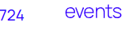

<h1 align="center">
  PROJET 9 
  724 EVENTS 
   
   
  
</h1>
<h2 align="center">DESCRIPTION</h2>
<h3 style="vertical-align: middle;">Projet réalisée lors de la formation d'integrateur Web d'
   
  Ce projet est une initiation à la réparation de bogues et la creation de test. 
</h3>
<h2 align="center">INFORMATION</h2>
<h3>Pour pouvoir faire fonctionner le site, télécharger le, puis executer la commande npm install dans le dossier du site et une fois installer executer npm start pour mettre le site en fonctionement</h3>
<table align="center" width=100% >
<caption>
    <h2 align="center">CONTENU</h2>
  </caption>
  <thead>
    <tr>
      <th style="text-align:center;">DOSSIER</th>
      <th style="text-align:center;">EXPLICATION</th>
    </tr>
  </thead>
  <tbody>
    <tr>
      <th style="text-align:center;">
    </th>
      <th style="text-align:center;">CONTIENT LE CODE DU SITE</th>
    </tr>
  </tbody>
</table>  

